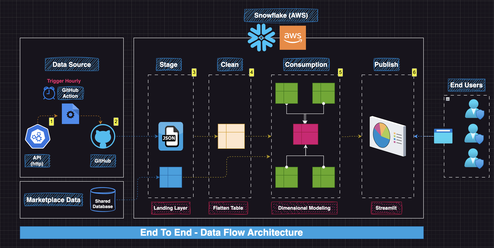

# Air Quality (Snowflake End-to-End Data Pipeline)




This project is an end-to-end **Air Quality** data pipeline built around **Snowflake**.

It:

- Extracts hourly air-quality observations from the Government of India open data API (`data.gov.in`).
- Lands raw JSON into a **Snowflake stage**.
- Builds a **stage → clean → consumption/publish** warehouse model using provided SQL scripts.
- Serves analytics through **Streamlit apps hosted on Snowflake**.
- Optionally automates ingestion on a schedule via **GitHub Actions**.

## Repository layout

- `01-sql-scripts/`
  - DDL/DML to create database, schemas, warehouses, stages and build curated tables.
- `02-raw-data/`
  - Sample/raw dataset files used during development.
- `03-streamlit-script/`
  - Streamlit apps (intended to run in Snowflake Streamlit).
- `04-snowpark-python/`
  - Snowpark ingestion script that fetches API data and uploads it to Snowflake stage.
- `05-git-action-pipeline/`
  - GitHub Actions workflow to run ingestion on a schedule.

## Architecture (high level)

- **Ingest**: `04-snowpark-python/ingest-api-data.py`
  - Calls `https://api.data.gov.in/resource/3b01bcb8-0b14-4abf-b6f2-c1bfd384ba69`
  - Writes a timestamped JSON file locally.
  - Uploads the JSON to Snowflake stage:
    - `@dev_db.stage_sch.raw_stg/india/<YYYY_MM_DD>/`
- **Transform**: `01-sql-scripts/*.sql`
  - Creates warehouse/database/schemas.
  - Loads from stage into curated tables.
  - Produces fact/dimension models and aggregated tables.
- **Serve**: `03-streamlit-script/*.py`
  - Reads curated tables (for example `DEV_DB.CONSUMPTION_SCH.AIR_QUALITY_FACT`, `...LOCATION_DIM`, `...DATE_DIM`).

## Prerequisites

- A Snowflake account.
- A role with permission to:
  - Create warehouse/database/schema (or access existing ones).
  - Create stages, load data, create tables/views.
- Python 3.9+ (recommended).
- Python packages:
  - `snowflake-snowpark-python`
  - `requests`
  - `pytz`

## Setup (Snowflake)

1. Open Snowflake Worksheet.
2. Run the warehouse/database bootstrap script:

   - `01-sql-scripts/01-db-schema-wh-ddl.sql`

3. Continue with the remaining SQL scripts in order:

   - `02-stage-layer-ddl-dml.sql`
   - `03-clean-layer-ddl-dml.sql`
   - `04-clean-transpose-table.sql`
   - `05-wide-table-consumption.sql`
   - `06-fact-and-dim.sql`
   - `07-aggregated-fact-table.sql`
   - `08-loading-additional-data.sql`
   - `09-data-sharing-agg-fact.sql`

Note: the scripts assume objects like `DEV_DB`, schemas (`STAGE_SCH`, `CLEAN_SCH`, `CONSUMPTION_SCH`, `PUBLISH_SCH`) and warehouses (`LOAD_WH`, `TRANSFORM_WH`, `STREAMLIT_WH`). Adjust naming if your account standards differ.

## Run ingestion (local)

1. Install dependencies:

   ```bash
   pip install "snowflake-snowpark-python[pandas]" requests pytz
   ```

2. Edit Snowflake credentials in `04-snowpark-python/ingest-api-data.py`:

   - `ACCOUNT`, `region`, `USER`, `PASSWORD`
   - `DATABASE`, `SCHEMA`, `WAREHOUSE`

3. Add your API key:

   - Set `api_key = '<add-app-api-key>'`

4. Run:

   ```bash
   python 04-snowpark-python/ingest-api-data.py
   ```

If successful, the script uploads a gzip-compressed JSON file to the Snowflake stage under the current IST date folder.

## Automate ingestion (GitHub Actions)

Workflow file:

- `05-git-action-pipeline/air_quality_hourly.yml`

It is scheduled via cron to run at the 45th minute of every hour.

Important:

- The ingestion script currently contains placeholder credentials and an API key placeholder.
- For a real automation setup, store secrets in GitHub (Actions Secrets) and update the ingestion script to read from environment variables (recommended) rather than hardcoding.

## Streamlit apps (on Snowflake)

Scripts live in `03-streamlit-script/` and are intended to be used with **Streamlit in Snowflake**.


Example:

- `03-air-quality-map.py`
  - Lets you select `State → City → Station → Date`
  - Queries `DEV_DB.CONSUMPTION_SCH.*`
  - Renders charts and a map

To run them in Snowflake:

1. Create a Streamlit app in Snowsight.
2. Select the database/schema containing your curated tables.
3. Set warehouse to `STREAMLIT_WH` (or your preferred warehouse).
4. Paste the script content into the Streamlit editor.

## Common troubleshooting

- **401/403 from API**
  - Your `data.gov.in` API key is missing/invalid.

- **Snowflake connection fails**
  - Check `ACCOUNT/region` formatting and network access.
  - Confirm role/warehouse/database/schema exist and you have permissions.

- **Stage path or object not found**
  - Ensure the stage referenced by the pipeline exists (created by the SQL scripts).
  - Verify the exact stage name and schema in your environment.

- **Streamlit app shows empty dropdowns**
  - Your dimension tables may not be populated yet.
  - Confirm transformation scripts ran successfully and the ingestion landed files in the expected date partition.

## Data source

Air quality observations are pulled from the Government of India open data platform via `data.gov.in` (resource id used in the ingestion script).

## Status

- Ingestion: implemented via Snowpark (`04-snowpark-python/ingest-api-data.py`)
- Transformations: implemented via SQL scripts (`01-sql-scripts/`)
- Visualization: implemented via Streamlit scripts (`03-streamlit-script/`)

